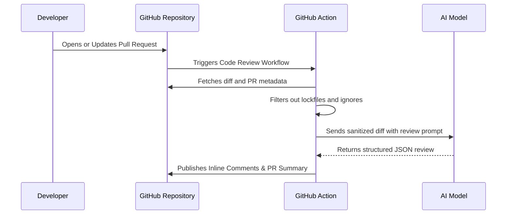

<!-- PROJECT SHIELDS -->
[![Build][build-shield]][build-url]
[![TypeScript][ts-shield]][ts-url]
[![License: MIT][license-shield]][license-url]

<!-- PROJECT LOGO -->
<br />
<div align="center">
  <h3 align="center">Open Source AI Code Review Agent</h3>

  <p align="center">
    Automated, context-aware code reviews directly in your GitHub workflow.
    <br />
    <br />
    <a href="#getting-started">Getting Started</a>
    ·
    <a href="#key-features">Key Features</a>
    ·
    <a href="#architecture">Architecture</a>
  </p>
</div>

<br />

<!-- TABLE OF CONTENTS -->
<details>
  <summary>Table of contents</summary>
  <ol>
    <li>
      <a href="#about-the-project">About the project</a>
    </li>
    <li>
      <a href="#key-features">Key features</a>
    </li>
    <li>
      <a href="#getting-started">Getting started</a>
    </li>
    <li>
      <a href="#configuration">Configuration</a>
    </li>
    <li>
      <a href="#architecture">Architecture</a>
    </li>
    <li>
      <a href="#local-development">Local development</a>
    </li>
  </ol>
</details>

<br />

<!-- ABOUT THE PROJECT -->
## About the project

The **nimo** is a fully transparent, heavily customizable automated assistant that reviews your team's code. It spots bugs, issues, code smells, and security vulnerabilities in Pull Requests and provides high-quality suggestions to fix them.

Unlike closed-box wrappers, this agent runs entirely on your GitHub Actions runner. You plug in your own API key for **Google Gemini**, **OpenAI**, or **Anthropic Claude**, allowing you to choose the exact model and price point you want. 

It seamlessly integrates with GitHub, automatically posting recommendations directly as inline comments within the corresponding Pull Request.

<p align="right">(<a href="#top">back to top</a>)</p>

## Key features

* **Multi-Model Intelligence:** Choose between Gemini 1.5, Gemini 2.0, GPT-4o, Claude 3.5, and more!
* **Context-Aware Reviews:** Posts targeted inline comments exactly where potential bugs, security flaws, or anti-patterns are detected.
* **Smart Filtering:** Automatically ignores auto-generated files, lock files (`package-lock.json`), and build directories (`dist/`) to preserve API tokens and focus the AI on meaningful logic.
* **Open Source & Transparent:** No hidden proprietary Docker images. The entire pipeline is open TypeScript code that you can audit, fork, and modify.

<p align="right">(<a href="#top">back to top</a>)</p>

## Getting started

You can easily integrate this reviewer into any of your existing repositories by adding a single GitHub Actions workflow.

### 1. Configure Repository Secrets
Navigate to your repository on GitHub:
`Settings` -> `Secrets and variables` -> `Actions` -> `New repository secret`
* Name: `GEMINI_API_KEY` (or the key for your chosen provider)
* Value: *Your API Key*

### 2. Add the Workflow File
Create a new file in your repository at `.github/workflows/ai-review.yml`:

```yaml
name: AI Code Review
on:
  pull_request:
    types: [opened, synchronize]

jobs:
  review:
    runs-on: ubuntu-latest
    permissions:
      contents: read
      pull-requests: write 
    steps:
      - name: Run AI Reviewer
        uses: Tukesh1/code-review-agent@main
        with:
          github_token: ${{ secrets.GITHUB_TOKEN }}
          ai_provider: 'gemini' 
          ai_model: 'gemini-3.1-flash-lite' 
          gemini_api_key: ${{ secrets.GEMINI_API_KEY }}
```

<p align="right">(<a href="#top">back to top</a>)</p>

## Configuration

| Input | Description | Default |
|---|---|---|
| `github_token` | Required to post comments. Use `${{ secrets.GITHUB_TOKEN }}`. | - |
| `ai_provider` | The AI service to use (`gemini`, `openai`, `claude`). | `gemini` |
| `ai_model` | Specific model string (e.g. `gpt-4o`, `gemini-3.1-flash-lite`). | `gemini-2.5-pro` |
| `custom_prompt` | Add your own rules (e.g. "Check for SQL injection, enforce strict TS"). | - |
| `gemini_api_key` | Required if using Google Gemini models. | - |
| `openai_api_key` | Required if using OpenAI models. | - |
| `claude_api_key` | Required if using Anthropic models. | - |

<p align="right">(<a href="#top">back to top</a>)</p>

## Architecture



<p align="right">(<a href="#top">back to top</a>)</p>

## Local development

This project is completely open source, and contributions are welcome! If you want to test changes locally before pushing:

1. Clone the repository and run `npm install`.
2. Create a `.env` file with a valid `GITHUB_TOKEN` and your AI API key.
3. Update `test.ts` to point to a test Pull Request.
4. Run `npx ts-node test.ts` to execute a full review run locally.

<p align="right">(<a href="#top">back to top</a>)</p>

<!-- MARKDOWN LINKS & IMAGES -->
[build-shield]: https://img.shields.io/badge/build-passing-brightgreen
[build-url]: #
[ts-shield]: https://img.shields.io/badge/TypeScript-Ready-blue
[ts-url]: #
[license-shield]: https://img.shields.io/badge/License-MIT-yellow.svg
[license-url]: #
