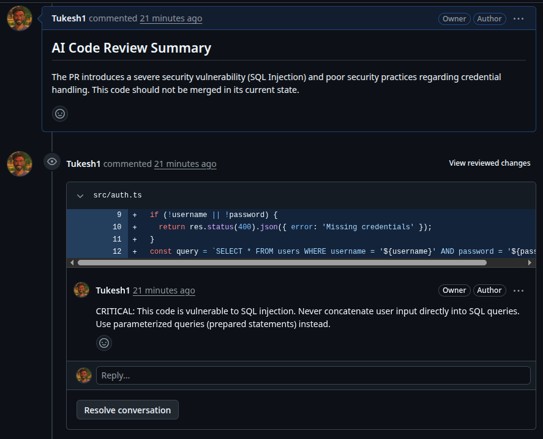
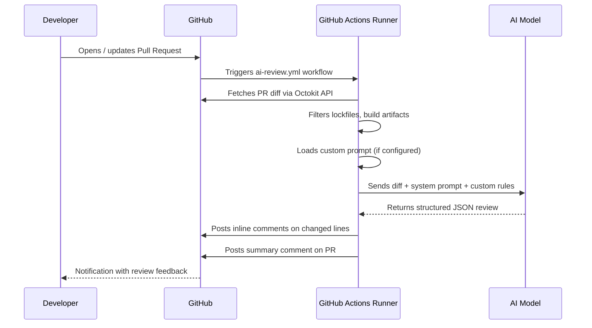

<div align="center">

#  AI Code Review Agent

**Open-source, privacy-first, AI-powered code reviews — right inside your Pull Requests.**

[](#)
[](#)
[](LICENSE)

[Getting Started](#-getting-started) · [Custom Prompts](#-custom-prompts) · [Configuration](#%EF%B8%8F-configuration-reference) · [Architecture](#-how-it-works)

</div>

---

## 📖 What is this?

An automated code reviewer that integrates directly into your GitHub workflow. Every time a Pull Request is opened or updated, this agent:

1. **Reads** the code diff via GitHub API.
2. **Sends** it to an AI model of your choice (Gemini, GPT, Claude).
3. **Posts** a detailed summary comment and targeted inline comments on the exact lines that need attention.

Unlike SaaS tools (CodeRabbit, Bito, Codacy), **your code never leaves your GitHub Actions runner**. You bring your own API key, you control the model, and you can read every line of the source.

<br />



*(**Note:** In the screenshot above, the agent posts under the username `Tukesh1`. This is because it was run locally using a Personal Access Token. When you deploy it via GitHub Actions, it will automatically post as `github-actions[bot]` unless you supply a custom bot token!)*

---

## ✨ Features

| Feature | Description |
|---|---|
| 🧠 **Multi-Model** | Supports Google Gemini, OpenAI GPT, and Anthropic Claude out of the box. |
| 📝 **Inline Comments** | Posts feedback on the exact lines where issues are found. |
| 📋 **PR Summaries** | Generates a high-level summary of the entire Pull Request. |
| 🎯 **Custom Prompts** | Teach the AI your team's coding standards via a simple text file. |
| 🔒 **Privacy-First** | Runs entirely on your own GitHub Actions runner. No external servers. |
| ⚡ **Smart Filtering** | Auto-skips lock files, build artifacts, and generated code to save tokens. |

---

## 🚀 Getting Started

### Step 1 — Add your API key as a repository secret

Go to your repository → `Settings` → `Secrets and variables` → `Actions` → **New repository secret**

| Secret Name | Value |
|---|---|
| `GEMINI_API_KEY` | Your Google AI API key |
| *(or)* `OPENAI_API_KEY` | Your OpenAI API key |
| *(or)* `CLAUDE_API_KEY` | Your Anthropic API key |

### Step 2 — Create the workflow file

Add this file to your repository at `.github/workflows/ai-review.yml`:

```yaml
name: AI Code Review

on:
  pull_request:
    types: [opened, synchronize]

jobs:
  review:
    runs-on: ubuntu-latest
    permissions:
      contents: read
      pull-requests: write

    steps:
      - uses: actions/checkout@v4

      - name: AI Code Review
        uses: Tukesh1/nimo-code-review-agent@main
        with:
          github_token: ${{ secrets.GITHUB_TOKEN }}
          ai_provider: 'gemini'
          ai_model: 'gemini-2.0-flash'
          gemini_api_key: ${{ secrets.GEMINI_API_KEY }}
```

**That's it.** Open a Pull Request and watch the bot post its review.

> [!WARNING]
> **Customizing the Bot's Name**
> By default, using `${{ secrets.GITHUB_TOKEN }}` causes all reviews to be posted by the **`github-actions[bot]`** account. If you want the agent to explicitly post under the name **Nimo** (or your own custom bot name), you must create a dedicated GitHub account for your bot, generate a Personal Access Token from that account, and pass it into the workflow instead of the default token!

---

## 🧠 Custom Prompts

This is where the agent becomes truly powerful. You can teach it your team's exact coding standards.

### Option A — Use a prompt file *(recommended)*

1. Create a file in your repo, e.g. `prompts/review_rules.txt`:

```text
TEAM RULES:
- Enforce strict TypeScript typing. The use of 'any' is forbidden.
- Check for SQL injection and XSS vulnerabilities.
- Flag functions longer than 50 lines.
```

2. Reference it in your workflow:

```yaml
      - name: AI Code Review
        uses: Tukesh1/nimo-code-review-agent@main
        with:
          github_token: ${{ secrets.GITHUB_TOKEN }}
          gemini_api_key: ${{ secrets.GEMINI_API_KEY }}
          custom_prompt_file: 'prompts/review_rules.txt'
```

### Option B — Inline in the workflow

```yaml
          custom_prompt: |
            Enforce strict TypeScript typing.
            Check for SQL injection vulnerabilities.
```

> 💡 **Tip:** A highly strict, advanced prompt file is included at [`prompts/custom_prompt.txt`](prompts/custom_prompt.txt). You can use it as-is or as a starting point for your own rules.

---

## ⚙️ Configuration Reference

| Input | Description | Default |
|---|---|---|
| `github_token` | GitHub token for posting comments. Use `${{ secrets.GITHUB_TOKEN }}`. | *Required* |
| `ai_provider` | AI service: `gemini`, `openai`, or `claude`. | `gemini` |
| `ai_model` | Model ID (e.g. `gemini-2.0-flash`, `gpt-4o`, `claude-3-5-sonnet-20240620`). | `gemini-2.5-pro` |
| `custom_prompt` | Inline additional instructions for the AI. | — |
| `custom_prompt_file` | Path to a `.txt` file in your repo with review rules. | — |
| `gemini_api_key` | API key for Google Gemini. | — |
| `openai_api_key` | API key for OpenAI. | — |
| `claude_api_key` | API key for Anthropic Claude. | — |

---

## 🏗 How It Works



### Project Structure

```
nimo-code-review-agent/
├── src/
│   ├── llm.ts             # Multi-provider AI adapter (Gemini, OpenAI, Claude)
│   ├── reviewer.ts         # Core orchestrator: diff parsing, filtering, review flow
│   ├── github.ts           # GitHub API wrapper (fetch PR, post comments)
│   ├── action-entry.ts     # GitHub Actions entrypoint
│   └── app-entry.ts        # Probot / GitHub App entrypoint (optional)
├── prompts/
│   └── custom_prompt.txt   # Advanced review rules (customizable)
├── action.yml              # GitHub Action definition
├── Dockerfile              # Container for the Action runtime
└── test.ts                 # Local testing script
```

---

## 🛠 Local Development

Want to test locally before deploying?

```bash
# 1. Clone and install
git clone https://github.com/Tukesh1/nimo-code-review-agent.git
cd nimo-code-review-agent
npm install

# 2. Create a .env file
cp .env.example .env
# Open .env and add your GITHUB_TOKEN and API key

# 3. Edit test.ts to point to your PR (owner, repo, pullNumber)

# 4. Run!
npx ts-node test.ts
```

---

## 🤝 Contributing

Contributions are welcome! Whether it's a bug fix, a new AI provider, or a better default prompt — open an issue or submit a PR.

1. Fork the repository.
2. Create your feature branch (`git checkout -b feat/amazing-feature`).
3. Commit your changes (`git commit -m 'feat: add amazing feature'`).
4. Push to the branch (`git push origin feat/amazing-feature`).
5. Open a Pull Request.

---

## 📄 License

Distributed under the MIT License. See [`LICENSE`](LICENSE) for more information.

---

<div align="center">
  <sub>Built with ❤️ by <a href="https://github.com/Tukesh1">Tukesh</a></sub>
</div>

<!-- MARKDOWN LINKS -->
[build-shield]: https://img.shields.io/badge/build-passing-brightgreen
[ts-shield]: https://img.shields.io/badge/TypeScript-Ready-blue
[license-shield]: https://img.shields.io/badge/License-MIT-yellow.svg
